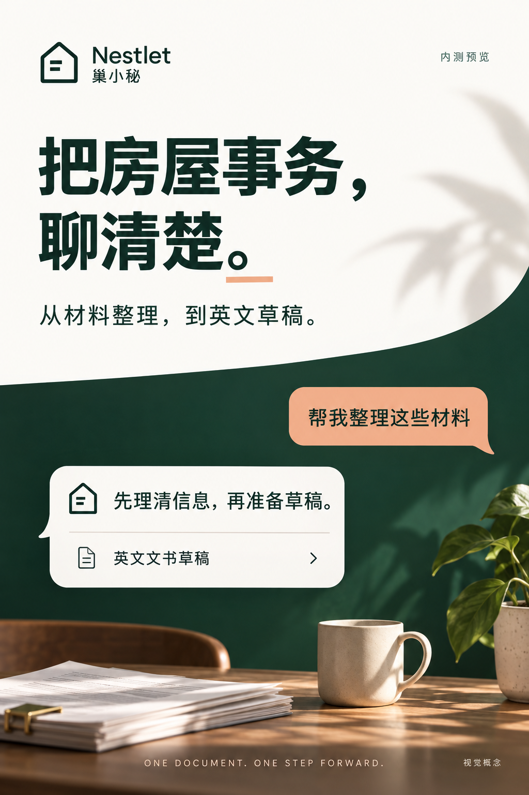

# Approved warm-forest direction for the Inbox refactor

The owner approved this exact reference and requested that it be sent to Kimi for the frontend adjustment. This supersedes the cold white/gray/blue proposal and the subsequent pending-palette state.

## Translate the direction into the application

- Preserve the approved Inbox three-column desktop structure: narrow customer/case list, central conversation/results, collapsible facts/files/status panel; single center plus drawers on mobile.
- Use a warm-neutral functional application center, deep forest accents/navigation, and restrained apricot/coral accents. Do not return to yellow-paper stationery.
- Use professional compact sans-serif typography, subtle borders, readable status hierarchy, and accessible contrast. The image is an aesthetic reference, not a specification for exact color values. Validate application tokens in actual UI.
- Do not copy the large decorative photography, poster-scale headings, plants, tabletop, or marketing composition into the workbench.
- Keep secondary official guidance collapsed/contextual, while relevant conflicts, failed saves, required consent and deadline warnings stay visible.
- Scope, functional ownership, exact file ACK and code-PR evidence requirements remain in issues #3 and #31. Root owns integration/auth/API/state; Kimi owns visual/layout/component shells.

## Evidence boundary

This is the owner-approved generated design reference, inspected before publication. It contains no private case/account information. It is not a screenshot of the product, not proof of implemented UI, and not functional acceptance. Kimi must deliver actual desktop/mobile screenshots in Chinese and English against an immutable code-PR SHA.
